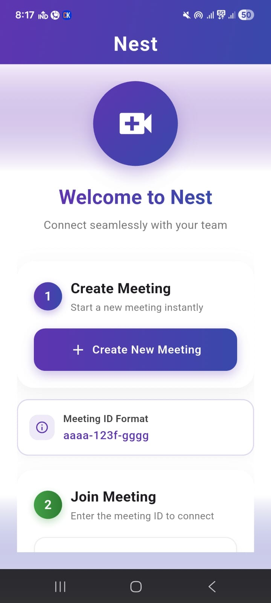
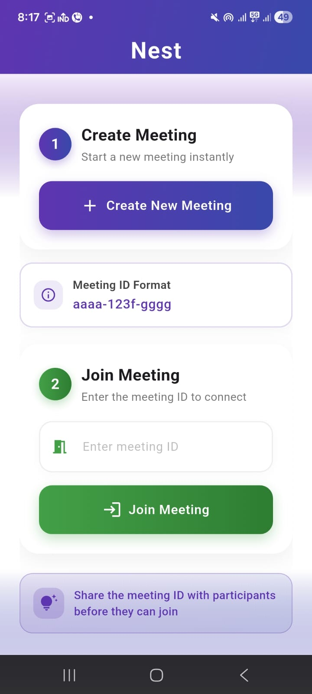
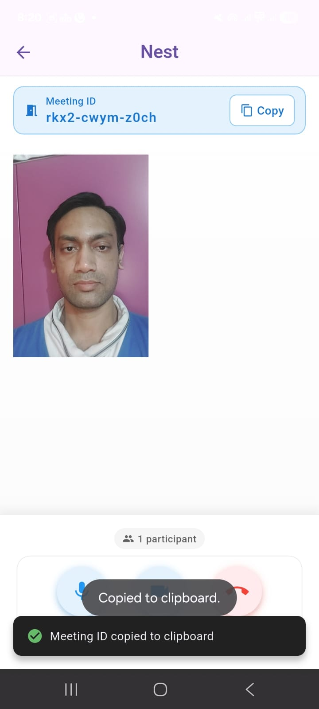
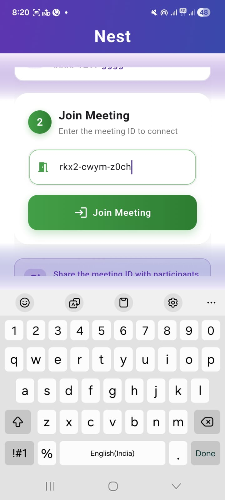
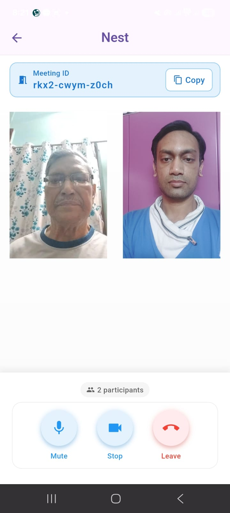

    📹 Nest

    Nest is a modern communication application built with Flutter that enables seamless video 
    meetings and real-time collaboration. It provides a clean, intuitive interface for users 
    to connect via video calls with features like mic/camera controls, participant management, 
    and easy meeting ID sharing.

    🚀 Features

    🔐 Join meeting with Meeting ID

    🎥 Enable / Disable Camera

    🎤 Mute / Unmute Microphone
    
    👥 View participants in real-time
    
    ❌ Leave meeting functionality
    
    📱 Cross-platform support (Android & iOS)
    
    🛠 Tech Stack
    
    Flutter
    
    Dart]()

    VideoSDK Flutter Quickstart
    
    REST API (for token generation)
    
    📦 Installation
    1️⃣ Clone the Repository
    git clone https://github.com/yourusername/flutter-video-call-app.git
    cd flutter-video-call-app
    
    2️⃣ Install Dependencies
    flutter pub get
    
    3️⃣ Add VideoSDK Token
    
    Update your authentication token inside the project (as required by VideoSDK).
    
    4️⃣ Run the App
    flutter run
    
    🔑 How It Works
    
    Generate a meeting ID.
    
    Join the meeting using the ID.
    
    Control camera and microphone.
    
    Communicate in real-time with participants.
    
    📸 Screenshots
    
    

    
    
    
    
    
    
    

    
    📌 Package Used
    
    videosdk_flutter_quickstart
    https://pub.dev/packages/videosdk
    
    💡 Use Cases
    
    Online Classes
    
    Business Meetings
    
    Telemedicine
    
    Customer Support
    
    Social Video Chat
    
    🤝 Contributing
    
    Contributions are welcome!
    Feel free to fork the repository and submit a pull request.
    
    📄 License
    
    This project is licensed under the MIT License.
